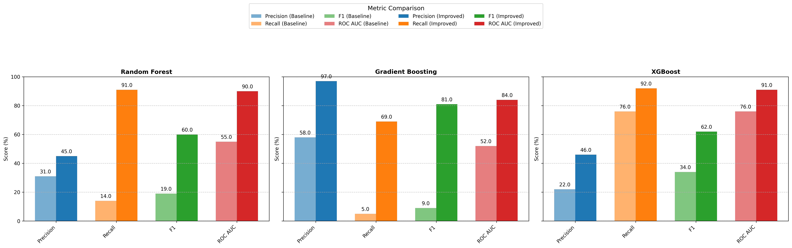

# Diabetes Risk Prediction: ML Model Comparison

## Overview
This project evaluates multiple machine learning models for **diabetes risk prediction**, comparing their performance across key metrics. The goal is to determine the most effective model for accurate risk assessment.

## Dataset
- The dataset consists of patient health indicators.
- Features include age, glucose levels, BMI, and other relevant medical attributes.
- Labels indicate whether a patient is at risk for diabetes.

## Models Compared
- **Random Forest (RF)**
- **Gradient Boosting (GB)**
- **XGBoost (XGB)**

## Performance Metrics
The following metrics were used to compare models:
- **Precision**: Ability to avoid false positives.
- **Recall**: Ability to detect true positives.
- **F1 Score**: Harmonic mean of precision and recall.
- **ROC AUC**: Overall model discrimination ability.

## Baseline Model Performance
| Model          | Precision | Recall | F1 Score | ROC AUC |
|---------------|----------|--------|----------|---------|
| Random Forest | 31.0     | 14.0   | 19.0     | 55.0    |
| Gradient Boosting | 58.0     | 5.0    | 9.0      | 52.0    |
| XGBoost       | 22.0     | 76.0   | 34.0     | 76.0    |

## Improved Model Performance
| Model          | Precision | Recall | F1 Score | ROC AUC |
|---------------|----------|--------|----------|---------|
| Random Forest | 45.0     | 91.0   | 60.0     | 90.0    |
| Gradient Boosting | 97.0     | 69.0   | 81.0     | 84.0    |
| XGBoost       | 46.0     | 92.0   | 62.0     | 91.0    |

## Visual Comparison


## Key Takeaways
- **Significant improvement** was observed after fine-tuning model parameters.
- **Gradient Boosting and XGBoost** demonstrated the best performance overall.
- **Hyperparameter tuning** and feature selection played a crucial role in boosting performance.

## How to Run
1. Clone this repository:  
   ```bash
   git clone https://github.com/yourusername/Diabetes-Risk-Prediction.git
   ```
2. Install dependencies:
   ```bash
   pip install -r requirements.txt
   ```
3. Run the notebook:
   ```bash
   jupyter notebook Diabetes_Risk_Prediction_ML_Comparison.ipynb
   ```

## Future Improvements
- Testing on a **larger dataset** for better generalization.
- Exploring **deep learning models** for enhanced accuracy.
- Implementing an **interactive web app** for real-time risk prediction.

## Author
Saad Makki<br> 
saadmakki116@gmail.com